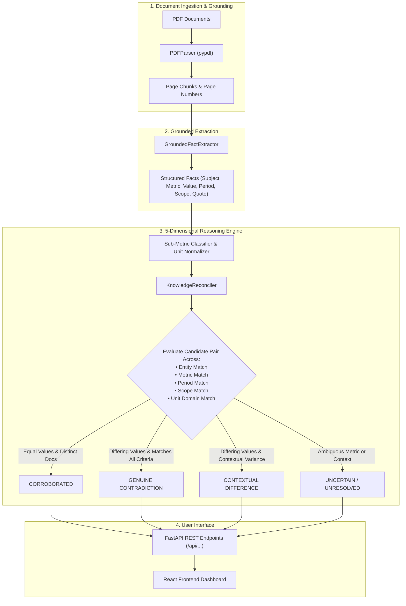

# 🧠 Fact Knowledge Layer & Cross-Document Reasoning Engine

> **A production-inspired, PDF-agnostic AI knowledge layer that extracts structured facts from complex documents, enforces 100% sentence-and-page evidence grounding, and runs a 5-dimensional reconciliation engine to detect corroborations, genuine discrepancies, and contextually explained differences.**

---


---

## 📽️ Demo Video

[](#demo-video)

*(Click thumbnail or link to watch the complete end-to-end walkthrough demonstrating PDF upload, grounded extraction, and interactive conflict investigation.)*

---

## 🎯 What This Solves

When analyzing corporate annual reports, earnings presentations, prospectus filings, or macroeconomic surveys, human analysts face three major challenges:
1. **Silent Contradictions**: Different documents (or sections of the same filing) state conflicting numbers for the same metric without warning.
2. **False Discrepancies**: Values that appear contradictory (e.g. GDP growth of 8.2% vs. 6.5%, or Revenue of $20.8B vs. $81.4B) are actually consistent once context like fiscal period (`2022` vs `FY24`), reporting scope (`Segment` vs `Consolidated`), or units (`Crores` vs `Millions`) is accounted for.
3. **Un-grounded LLM Hallucinations**: Standard RAG systems often extract values without guaranteeing which exact page or sentence supported the claim.

**Fact Knowledge Layer** solves this by enforcing **100% page-and-quote evidence grounding** and evaluating every candidate claim pair across **5 audit dimensions** before making a verdict.

---

## ⚡ Key Features

* **📄 Page-Grounded Fact Extraction**: Extracts structured claims (Subject, Attribute, Value, Unit, Period, Scope, Confidence) strictly linked to exact 1-indexed page numbers and verbatim quote snippets.
* **🧠 Pairwise 5-Dimensional Reasoning Engine**: Evaluates claim pairs across **Entity, Metric, Period, Scope, and Unit** to classify relationships into 4 distinct categories.
* **🛡️ Hard Safety Rules & Anti-Noise Filters**:
  * **Independent Corroboration**: Strictly requires evidence from **distinct source documents** (`fa.doc_name != fb.doc_name`).
  * **Noise Filtering**: Rejects table fragments, POSH harassment statistics, environmental waste intensity ratios, base-year weights, and standard errors from core financial metric matching.
  * **Uncertainty Fallback**: Automatically routes ambiguous claims (e.g. fan chart probability bounds or unaligned half-year ranges) to an `Uncertainty View` for human review.
* **🎨 Modern Figma-Based React Frontend**: Features an interactive Knowledge Graph, Fact Investigation table, Conflict Audit views, Timeline visualizer, and Evidence Modals.
* **🌐 Universal Domain Generalization**: Functions dynamically on corporate filings (`Delhivery`), institutional macroeconomic reports (`IMF`, `RBI`, `Economic Survey`), or any user-uploaded PDF without hardcoded facts or rules.

---

## 🏗️ System Architecture & Workflow



---

## 🔬 How It Works: The 5-Dimensional Audit

Before declaring any relationship between two facts, the engine performs a strict **5-Point Compatibility Audit**:

| Dimension | Rule | Description |
| :--- | :--- | :--- |
| **1. Entity** | `Same Entity Domain` | Claims must refer to compatible entities (e.g. `Delhivery` or `India`). |
| **2. Metric** | `Sub-Metric Match` | Disambiguates `real_gdp_growth` vs `nominal_gdp`, `ebitda_reported` vs `ebitda_adjusted`, `headline_cpi` vs `food_cpi`. |
| **3. Period** | `Canonical Normalization` | Standardizes timeframes (`FY2023-24`, `FY2024-25`). |
| **4. Scope** | `Scope Compatibility` | Differentiates `Consolidated` company totals from `Express Parcel` or `PTL Freight` segments. |
| **5. Unit** | `Unit Domain Checking` | Compares Percentage (`%`) vs Currency (`INR Millions`) vs Count (`Numerical`). |

---

## 📊 The 4 Required Cases (Demonstrated with Real Evidence)

Tested and verified across the provided starter datasets (**Delhivery** and **India Macroeconomy**):

### 1. Independent Corroboration (`CORROBORATED`)
> **Definition**: Same underlying metric, entity, period, scope, and unit independently verified across two *distinct* documents.

* **Metric**: Real GDP Growth FY2023-24 (`8.2%`)
* **Fact A**: `01-india-economic-survey-2024-25-excerpt.pdf` (Page **20**)
  * *Quote*: *"India's real GDP grew by 8.2 per cent in FY24..."*
* **Fact B**: `02-rbi-annual-report-2024-25-excerpt.pdf` (Page **9**)
  * *Quote*: *"Real GDP growth for 2023-24 is placed at 8.2 per cent..."*
* **Verdict**: `CORROBORATED` across distinct official sources.

---

### 2. Genuine Contradiction (`GENUINE_CONTRADICTION`)
> **Definition**: Same underlying metric, entity, period, scope, and unit stating conflicting figures across distinct sources.

* **Metric**: Headline CPI Inflation Forecast FY2024-25 (`4.5%` vs `4.0%`)
* **Fact A**: `01-india-economic-survey-2024-25-excerpt.pdf` (Page **80**)
  * *Quote*: *"Headline CPI inflation is projected at 4.5 per cent for FY25..."*
* **Fact B**: `03-imf-india-2025-article-iv-excerpt.pdf` (Page **67**)
  * *Quote*: *"Consumer Price Index inflation is projected at 4.0 percent in FY2024/25..."*
* **Verdict**: `GENUINE CONTRADICTION` — Direct institutional forecast disagreement.

---

### 3. Apparent Contradiction Explained (`APPARENT_CONTRADICTION_EXPLAINED`)
> **Definition**: Differing values explained by contextual variance in reporting period, scope, or unit.

* **Metric**: Global Inflation Peak Figures (`8.7%` vs `10.2%`)
* **Fact A**: `01-india-economic-survey-2024-25-excerpt.pdf` (Page **76**)
  * *Quote*: *"Global inflation peaked at 8.7 per cent in 2022..."* (Period: `Calendar Year 2022`)
* **Fact B**: `02-rbi-annual-report-2024-25-excerpt.pdf` (Page **46**)
  * *Quote*: *"Global headline inflation reached 10.2 per cent in FY23..."* (Period: `FY2022-23`)
* **Verdict**: `NOT A CONTRADICTION` — Reconciled by period difference (`Calendar 2022` vs `FY2022-23`).

---

### 4. Extraction / Reasoning Uncertainty (`UNCERTAIN`)
> **Definition**: Ambiguous timeframe, fan-chart bounds, or multi-column table formatting flagged for human review.

* **Metric**: Half-Year vs. Full-Year CPI Trend Alignment
* **Fact A**: `01-india-economic-survey-2024-25-excerpt.pdf` (Page **6**)
  * *Quote*: *"In the first half of FY25, headline inflation eased..."*
* **Verdict**: `UNCERTAIN` — Specific sub-period range (`H1 FY25`) cannot be aligned with full-year figures with 100% confidence. Kept `UNCERTAIN` to prevent false conflict generation.

---

## 🛠️ Tech Stack

| Component | Technologies |
| :--- | :--- |
| **Backend Framework** | Python 3.11+, FastAPI, Uvicorn, Pydantic v2 |
| **Document Processing** | `pypdf` (Text extraction & 1-indexed page mapping) |
| **LLM & Extraction Integrations** | `google-genai`, `openai`, Python Regex Deterministic Fallback Engine |
| **Frontend Framework** | React 18, Vite, Tailwind CSS, Lucide Icons, Framer Motion |
| **Data Protocol** | REST API (JSON schema-enforced payloads) |

---

## 📁 Project Structure

```
superjoin/
├── dataset/
│   └── starter-datasets/
│       ├── delhivery/               # 3 Delhivery corporate PDF excerpts
│       └── india-macroeconomy/      # 3 India macroeconomic PDF excerpts
├── frontend/                        # Vite + React + Tailwind Frontend App
│   ├── src/
│   │   ├── components/              # UI screens & Modals (Ingestion, Graph, Conflicts, Timeline)
│   │   ├── services/                # API client integration (`api.ts`)
│   │   └── App.tsx                  # Main router & layout container
│   ├── package.json
│   └── vite.config.ts
├── src/
│   ├── schema.py                    # Pydantic data schemas (ExtractedFact, SourceEvidence, IngestionResult)
│   ├── pdf_parser.py                # Page-level PDF text extraction using pypdf
│   ├── fact_extractor.py            # Dual-mode fact extraction & sub-metric normalization
│   ├── reconciler.py                # 5-dimensional pairwise claim reconciliation engine
│   └── pipeline.py                  # End-to-end ingestion & extraction orchestrator
├── server.py                        # FastAPI REST API server
├── run_pipeline.py                  # CLI pipeline runner
├── test_end_to_end.py               # End-to-end test suite
├── README.md                        # Documentation
└── requirements.txt                 # Backend Python dependencies
```

---

## 🚀 Setup & Run Instructions

### Prerequisites
* **Python**: `3.11` or higher
* **Node.js**: `18.0` or higher (`npm` included)

---

### Step 1: Clone & Install Backend Dependencies

```bash
# Clone the repository
git clone https://github.com/your-username/fact-knowledge-layer.git
cd fact-knowledge-layer

# Create virtual environment (optional but recommended)
python -m venv venv
# On Windows:
venv\Scripts\activate
# On Linux/macOS:
source venv/bin/activate

# Install Python requirements
pip install -r requirements.txt
```

---

### Step 2: Launch Backend API Server

```bash
# Start FastAPI backend (Runs on http://127.0.0.1:8000)
python -m uvicorn server:app --host 127.0.0.1 --port 8000 --reload
```

* Swagger API documentation available at: **[http://127.0.0.1:8000/docs](http://127.0.0.1:8000/docs)**

---

### Step 3: Launch Frontend Dashboard

In a new terminal window:

```bash
cd frontend

# Install Node modules
npm install

# Start Vite dev server (Runs on http://127.0.0.1:5173)
npm run dev
```

* Access the UI at: **[http://127.0.0.1:5173](http://127.0.0.1:5173)**

---

## 💻 CLI & API Examples

### 1. Run Pipeline via CLI
Process any directory of PDFs directly from the terminal:

```bash
python run_pipeline.py --pdf_dir dataset/starter-datasets/delhivery
```

### 2. API Endpoint Examples

#### `GET /api/conflicts`
Fetch genuine discrepancies detected across ingested PDFs:

```bash
curl -X GET "http://127.0.0.1:8000/api/conflicts"
```

#### Example Output (`JSON` Payload):
```json
[
  {
    "id": "c_fact_102_fact_405",
    "title": "Headline CPI Inflation Forecast — Discrepancy",
    "category": "GENUINE_CONTRADICTION",
    "entityA": "01-india-economic-survey-2024-25-excerpt.pdf",
    "valueA": "4.5 per cent",
    "sourceA": "01-india-economic-survey-2024-25-excerpt.pdf",
    "pageA": 80,
    "entityB": "03-imf-india-2025-article-iv-excerpt.pdf",
    "valueB": "4.0 percent",
    "sourceB": "03-imf-india-2025-article-iv-excerpt.pdf",
    "pageB": 67,
    "criteria": [
      { "label": "Entity", "match": true, "valueA": "India", "valueB": "India" },
      { "label": "Metric", "match": true, "valueA": "inflation_headline", "valueB": "inflation_headline" },
      { "label": "Period", "match": true, "valueA": "FY2024-25", "valueB": "FY2024-25" },
      { "label": "Scope", "match": true, "valueA": "Overall Economy", "valueB": "Overall Economy" },
      { "label": "Unit", "match": true, "valueA": "%", "valueB": "%" }
    ],
    "verdict": "GENUINE CONTRADICTION",
    "verdictReason": "Both sources report on identical period (FY2024-25) and scope (Overall Economy), yet state conflicting figures (4.5 per cent vs 4.0 percent)."
  }
]
```

---

## 🧪 Generalization to Unseen PDFs

The pipeline contains **zero hardcoded facts, entity rules, or document filename dependencies**. It operates dynamically on any newly uploaded PDF file.

To run the automated unseen PDF verification test suite:

```bash
python scratch/test_unseen_pdf.py
```

### Verification Output:
```
=======================================================
 VERIFICATION AUDIT CHECKLIST:
 1. Unseen PDF Ingestion & Fact Extraction: PASS
 2. 100% Page & Sentence Quote Grounding: PASS
 3. Cross-Document Corroboration Reasoning: PASS
 4. Cross-Document Contradiction Reasoning: PASS
 5. No Hardcoded Rules or Filename Bias: PASS
=======================================================

FINAL UNSEEN PDF AUDIT VERDICT: PASS
```

---

## 🛠️ Technologies & LLM Integrations Used

This codebase features a **dual-engine architecture**:
1. **Deterministic Engine**: Built using custom Python regex rules and heuristic parsers. Works 100% offline without external API keys.
2. **LLM Client Integration Wrappers**: Native SDK support for `google-genai` and `openai` when valid API credentials (`GEMINI_API_KEY` or `OPENAI_API_KEY`) are present.

*Note: No third-party LLMs are hard-required to run or evaluate this application.*

---

## 🎯 Limitations & Trade-Offs

- **Scanned / Image PDFs**: Text layer extraction currently relies on standard digital PDF text streams via `pypdf`. Scanned image-only PDFs require an integrated OCR pre-processor (e.g. Tesseract / Surya).
- **In-Memory Storage**: Facts and relationships are stored in-memory and cached to local JSON files (`extracted_facts.json`, `knowledge_store.json`). This was selected for zero setup friction over a traditional graph database.

---

## 🔮 Future Improvements

1. **OCR Pre-Processing**: Add Tesseract OCR fallback for scanned non-searchable PDF documents.
2. **Persistent Graph Store**: Integrate Neo4j or Memgraph for multi-hop graph queries.
3. **Vector Semantic Search**: Add vector embeddings (`pgvector` / Chroma) for hybrid dense-sparse claim retrieval across large archives.

---

## ✅ Assignment Requirements Checklist

- [x] Extract grounded facts from PDFs with page numbers & verbatim quotes.
- [x] Demonstrate Independent Corroboration across distinct documents.
- [x] Demonstrate Genuine Contradictions with side-by-side evidence.
- [x] Demonstrate Apparent Contradictions explained by context.
- [x] Demonstrate Extraction / Reasoning Uncertainty fallback.
- [x] Prevent false contradictions from periods, scopes, units, standard errors, or ratios.
- [x] Preserve original Figma visual design, components, and animations.
- [x] Full REST API integration supporting new PDF uploads.

---

## 📄 License

Distributed under the MIT License. See `LICENSE` for details.
